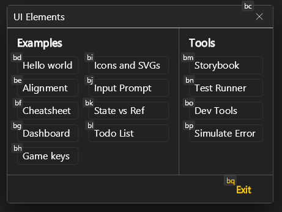
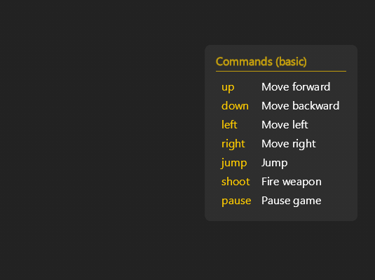

# UI Elements

[ui_elements](.) is an experimental library for building stateful voice activated canvas UIs using a HTML/CSS/React-inspired syntax for python, for use with [Talon](https://talonvoice.com/).


## Features
- 20+ elements such as `div`, `text`, `button`, `table`, `icon`, `input_text`, `cursor`
- 90+ CSS-like properties such as `width`, `background_color`, `margin`, `padding_left`, `flex_direction`
- Reactive utilties `state`, `effect`, and `ref`
- Dragging and scrolling
- Talon actions for highlighting elements, changing state, setting text
- Voice activated hints
- Skia canvas based rendering

## Prerequisites
- [Talon](https://talonvoice.com/)

## Installation
Download or clone this repository into your Talon user directory.

```sh
# mac and linux
cd ~/.talon/user

# windows
cd ~/AppData/Roaming/talon/user

git clone https://github.com/rokubop/talon-ui-elements.git
```

Done! 🎉 Start learning below.

## Examples

Say "elements test" to bring up the examples.



## ✨ Tutorials

| Tutorial | Preview | Concepts Covered |
|----------|---------|------------------|
| 👋 [Hello World](docs/tutorials/hello_world.md) |  | `screen`, `div`, `text`, CSS-like properties, `ui_elements_show()`, `ui_elements_hide()` |
| 📜 [Cheatsheet](docs/tutorials/cheatsheet.md) |  | `state`, `table`, `tr`, `td`, `style`, flexbox, dragging, `ui_elements_set_state()` |
| 🎮 [Game Key Overlay](docs/tutorials/game_keys.md) |  | `icon`, `style`, grid layouts, reusable functions, `ui_elements_highlight()`, `ui_elements_highlight_briefly()` |

### 📜 References

- [Elements](docs/elements.md)
- [Properties](docs/properties.md)
- [Talon actions](docs/actions.md)
- [Icons](docs/icons.md)

### 📚 Concepts
- [Components](docs/concepts/components.md)
- [Cursor](docs/concepts/cursor.md)
- [Defaults](docs/concepts/defaults.md)
- [Effect](docs/concepts/effect.md)
- [Ref](docs/concepts/ref.md)
- [Rendering](docs/concepts/rendering.md)
- [State](docs/concepts/state.md)
- [Style](docs/concepts/style.md)
- [SVG](docs/concepts/svgs.md)
- [Window](docs/concepts/window.md)

### Other examples
- [Dashboard](examples/dashboard/dashboard_ui.py)
- [Todo List](examples/todo_list/todo_list_ui.py)
- [Inputs](examples/inputs/inputs_ui.py)
- [Alignment](examples/alignment/alignment_ui.py)

## Development suggestions
While developing, you might get into a state where the UI gets stuck on your screen and you need to restart Talon. For this reason, it's recommended to have a "talon restart" command.

In a `.talon` file:
```
^talon restart$:            user.talon_restart()
```

Inside of a `.py` file:
```py
import os
from talon import Module, actions, ui

mod = Module()

@mod.action_class
class Actions:
    def talon_restart():
        """restart talon"""
        # for windows only
        talon_app = ui.apps(pid=os.getpid())[0]
        os.startfile(talon_app.exe)
        talon_app.quit()
```

- Sometimes the UI may not refresh after saving the file. Try hiding the UI, saving the file again, and showing again.

- Recommend using "Andreas Talon" VSCode extension + its dependency pokey command server, so you can get autocomplete for talon user actions, and hover over hint documentation on things like `actions.user.ui_elements()` or `actions.user.ui_elements_show()`.

## Under the hood
Uses Talon's `Canvas` and Skia canvas integration under the hood, along with Talon's experimental `TextArea` for input.