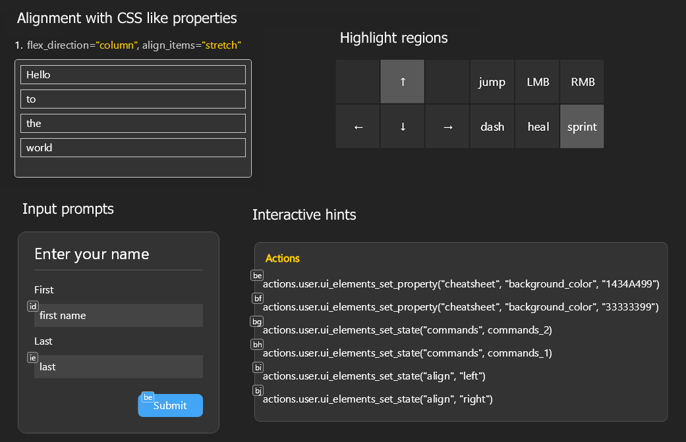
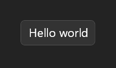

# ui_elements

[ui_elements](.) is an experimental library for building stateful voice activated overlays and UIs using HTML/CSS/React-like syntax, for use with [Talon](https://talonvoice.com/).



- 8 Example UIs
- HTML like elements such as `div`, `text`, `button`, `input_text`
- CSS like properties such as `width`, `background_color`, `margin`, `padding`, `flex_direction`
- Reactive utilties `state`, `effect`, and `ref`
- Talon actions for setting text, highlighting elements, and changing state
- Voice activated hints displayed on all buttons and text inputs

## Installation
Clone this repository into your Talon user directory.

```sh
# mac and linux
cd ~/.talon/user

# windows
cd ~/AppData/Roaming/talon/user

git clone https://github.com/rokubop/talon-ui-elements.git
```

Done! 🎉 Now you can build UIs in Talon using `actions.user.ui_elements(...), actions.user.ui_elements_show(...)`, `actions.user.ui_elements_hide(...)`, etc...

## Usage
Choose [elements](#elements) from `actions.user.ui_elements` and create a renderer function

```py
def hello_world_ui():
    (screen, div, text) = actions.user.ui_elements(["screen", "div", "text"])

    return screen()[
        div()[
            text("Hello world")
        ]
    ]

actions.user.ui_elements_show(hello_world_ui)
```

To define styles, we put it inside of the **parentheses**. To define children, we put it inside the **square brackets**.
```py
def hello_world_ui():
    (screen, div, text) = actions.user.ui_elements(["screen", "div", "text"])

    return screen(justify_content="center", align_items="center")[
        div(background_color="333333", padding=16, border_radius=8, border_width=1)[
            text("Hello world", font_size=24)
        ]
    ]

actions.user.ui_elements_show(hello_world_ui)
```

<p align="center">
  
</p>

See all supported [properties](./docs/properties.md) for styling.

To hide and destroy the UI:
```py
actions.user.ui_elements_hide(hello_world_ui)
# or
actions.user.ui_elements_hide_all()
```

## Examples

Checkout out examples in the [examples](./examples) folder. Or say "elements test" to view live interactive examples.
| Example | Preview | Description |
|----|----|----|
| [alignment_ui](./examples/alignment_ui.py) | [preview](./examples/alignment_preview.png) |Showcase 9 different flexbox arrangements |
| [cheatsheet_ui](./examples/cheatsheet_ui.py) | [preview](./examples/cheatsheet_preview.png) | A list of commands on the left or right of your screen that can change state |
| [dashboard_ui](./examples/dashboard_ui.py) | [preview](./examples/dashboard_preview.png) | Has a title bar, a side bar, and a reactive body |
| [game_keys_ui](./examples/game_keys_ui.py) | [preview](./examples/game_keys_preview.png) | Game keys overlay for gaming, that highlights respective keys |
| [hello_world_ui](./examples/hello_world_ui.py) | [preview](./examples/hello_world_preview.png) | Simple hello world UI |
| [inputs_ui](./examples/inputs_ui.py) | [preview](./examples/inputs_preview.png) | Text input, ref, validation, and submit with a button |
| [state_vs_refs_ui](examples/state_vs_refs_ui.py) | [preview](./examples/state_vs_refs_preview.png) | Two versions of a counter using state or ref |
| [todo_list_ui](./examples/todo_list_ui.py) | [preview](./examples/todo_list_preview.png) | A todo list with an input, add, and remove functionality |


## Elements
returned from `actions.user.ui_elements`:

- `screen` - The root element. Basically a div the size of your screen.
- `div` - Standard container element.
- `text`
- `button`
- `input_text` - Uses Talon's experimental `TextArea` for input.
- `state` - Global reactive state that rerenders respective UIs when changed.
- `effect` - Run side effects on mount, unmount, or state change.
- `ref` - Reference to an element "id", which provides a way to imperatively get and set properties, with reactive updates. Useful for `input_text` value.

## Box Model
ui_elements have the same box model as normal HTML, with `margin`, `border`, `padding`, and `width` and `height` and operate under `box-sizing: border-box` assumption, meaning border and padding are included in the width and height.

## Flex by default
ui_elements are all `display: flex`, and default to `flex_direction="column"`with `align_items="stretch"`. This means when you don't provide anything, it will act similarly to `display: block`.

### Alignment examples
If you aren't familiar with flexbox, check out this [CSS Tricks Guide to Flexbox](https://css-tricks.com/snippets/css/a-guide-to-flexbox/).

Some examples:
```py
# children of screen will be bottom right
screen(align_items="flex_end", justify_content="flex_end")

# children of screen will be center
screen(align_items="center", justify_content="center")

# children of screen will be top left
screen(align_items="flex_start", justify_content="flex_start")

# children of screen will be top right
screen(flex_direction="row", align_items="flex_start", justify_content="flex_end")

# full width or height depending on flex_direction
div(flex=1)
```

See [alignment_ui](./examples/alignment_ui.py) for more.
## State

```py
..., state = actions.user.ui_elements([... "state"])

tab, set_tab = state.use("tab", 1)

# do conditional rendering with tab
```

`state.use` behaves like React’s `useState`. It returns a tuple (value, set_value). You must define a state key (e.g. `"tab"` in this case), so that `actions.user.ui_elements*` can also target it, and optionally a default value.

To change state, we can use `set_tab` from above, or we can use Talon actions:
```py
actions.user.ui_elements_set_state("tab", 2)
actions.user.ui_elements_set_state("tab", lambda tab: tab + 1)
```

State changes cause a full rerender (for now).


If the UI doesn't need a setter, than we can use `state.get`, which is just the value.

```py
tab = state.get("tab", 1)
```

Read more about [state](./docs/state.md).

### Disclaimer

If you just need to update text or highlight, use the below methods instead, as those render on a separate decoration layer which are faster, and do not cause a full rerender.

## Updating text
We must give a unique id to the thing we want to update.
```py
text("Hello world", id="test"),
```

Then we can use this action to update the text:
```py
actions.user.ui_elements_set_text("test", "New text")
```

## Highlighting elements
We must give a unique id to the thing we want to highlight.
```py
div(id="box")[
    text("Hello world"),
]
```

We can then use these actions to trigger a highlight or unhighlight:
```py
actions.user.ui_elements_highlight("box")
actions.user.ui_elements_highlight_briefly("box")
actions.user.ui_elements_unhighlight("box")

# highlight color FF0000 with transparency of aa
actions.user.ui_elements_highlight_briefly("box", "FF0000aa")
```

## Buttons
If you use a button, the UI will block the mouse instead of being pass through, and voice activated hints will automatially appear on the button.
```py
# button
button("Click me", on_click=lambda e: print("clicked")),
button("Click me", on_click=actions.user.ui_elements_hide_all),
```

## Text inputs
See [inputs_ui](./examples/inputs_ui.py) for example.

## Unpacking a list
```py
commands = [
    "left",
    "right",
    "up",
    "down"
]
div(gap=8)[
    text("Commands", font_weight="bold"),
    *[text(command) for command in commands]
],
```

## Opacity
```py
# 50% opacity
div(background_color="FF0000", opacity=0.5)[
    text("Hello world")
]

# or we can use the last 2 digits of the color
div(background_color="FF000088")[
    text("Hello world")
]
```

## Alternate screen
```py
# screen 1
screen(1, align_items="flex_end", justify_content="center")[
    div()[
        text("Hello world")
    ]
]
# or
screen(screen=2, align_items="flex_end", justify_content="center")[
    div()[
        text("Hello world")
    ]
]
```

## Documentation
| Documentation | Description |
|---------------|-------------|
| [Actions](./ui_elements.py) | Talon actions you can use (`actions.user.ui_elements*`) |
| [Defaults](./docs/defaults.md) | Default values for all properties |
| [Properties](./docs/properties.md) | List of all properties you can use |
| [Effect](./docs/effect.md) | Side effects on mount, unmount, or state change |
| [State](./docs/state.md) | Global reactive state that rerenders respective UIs when changed |
| [Ref](./docs/ref.md) | Reference to an element "id", which provides a way to imperatively get and set properties, with reactive updates |

## Under the hood
Uses Talon's `Canvas` and Skia canvas integration under the hood, along with Talon's experimental `TextArea` for input.

## Dependencies
none