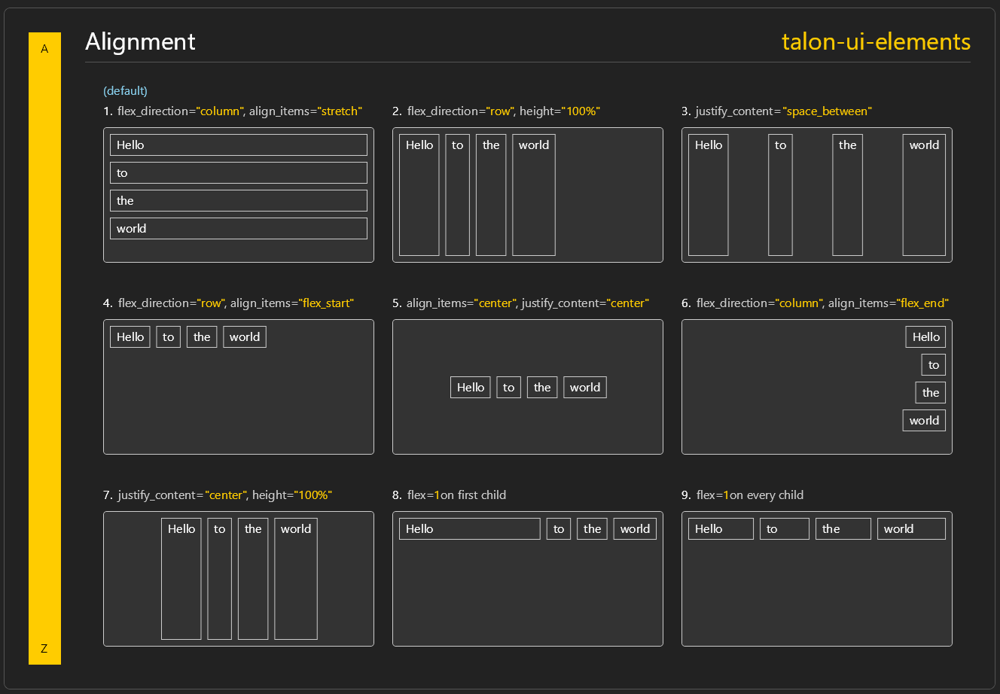

# ui_elements

[ui_elements](.) is an experimental library for building stateful voice activated canvas UIs using a HTML/CSS/React-inspired syntax for python, for use with [Talon](https://talonvoice.com/).


- 9 Example UIs
- HTML-like elements such as `div`, `text`, `button`, `input_text`
- 60+ CSS-like properties such as `width`, `background_color`, `margin`, `padding_left`, `flex_direction`
- Reactive utilties `state`, `effect`, and `ref`
- Dragging and scrolling
- Talon actions for highlighting elements, changing state, setting text
- Voice activated hints

## Prerequisites
- [Talon](https://talonvoice.com/)

## Installation
Download or clone this repository into your Talon user directory.

```sh
# mac and linux
cd ~/.talon/user

# windows
cd ~/AppData/Roaming/talon/user

git clone https://github.com/rokubop/talon-ui-elements.git
```

Done! 🎉 Say "elements test" to try out examples. Start learning below.

## Usage
Choose [elements](#elements) from `actions.user.ui_elements` and create a **renderer function** in any `.py` file in your Talon user directory.

```py
def hello_world_ui():
    screen, div, text = actions.user.ui_elements(["screen", "div", "text"])

    return screen()[
        div()[
            text("Hello world")
        ]
    ]
```

To define styles, we put it inside of the **parentheses**. To define children, we put it inside the **square brackets**.
```py
def hello_world_ui():
    screen, div, text = actions.user.ui_elements(["screen", "div", "text"])

    return screen(justify_content="center", align_items="center")[
        div(background_color="333333", padding=16, border_radius=8, border_width=1)[
            text("Hello world", font_size=24)
        ]
    ]
```

Now we just need to show and hide it, so let's create two Talon actions. Here's the full `.py` code:
```py
from talon import Module, actions

mod = Module()

def hello_world_ui():
    screen, div, text = actions.user.ui_elements(["screen", "div", "text"])

    return screen(justify_content="center", align_items="center")[
        div(background_color="333333", padding=16, border_radius=8, border_width=1)[
            text("Hello world", font_size=24)
        ]
    ]

@mod.action_class
class Actions:
    def show_hello_world():
        """Show hello world UI"""
        actions.user.ui_elements_show(hello_world_ui)

    def hide_hello_world():
        """Hide hello world UI"""
        actions.user.ui_elements_hide_all()
        # or actions.user.ui_elements_hide(hello_world_ui)
```

And in any `.talon` file:
```talon
show hello world: user.show_hello_world()
hide hello world: user.hide_hello_world()
```

Now when you say "show hello world", the UI should appear.

<p align="center">
  
</p>

Congratulations! You've created your first UI. 🎉

See all supported [properties](./docs/properties.md) for styling.

> Note: It's a good idea to say "talon open log" and watch the log while developing. This will help you with supported properties and incorrect usage. You also might want to create a "talon restart" command in case changes don't apply while developing. See [Development suggestions](#development-suggestions).

## Examples

Say "elements test" to bring up the examples.

<p align="center">
  
</p>

You can find these in the [examples](./examples) folder for code and previews.

## Elements
Returned from `actions.user.ui_elements`:

Example:
```py
screen, div, button = actions.user.ui_elements(["screen", "div", "button"])
```

| Element | Description |
|---------|-------------|
| `screen` | Root element. A div the size of your screen. |
| `active_window` | Root element. A div the size of the currently active window. |
| `div` | Standard container element. |
| `text` | Basic strings supported. Combine multiple together if you want to style differently. |
| `button` | Accepts `on_click` |
| `icon` | See supported [icons](docs/icons_and_svgs.md) |
| `input_text` | Uses Talon's experimental `TextArea` for input. |
| `state` | Global reactive state that rerenders respective UIs when changed. |
| `effect` | Run side effects on mount, unmount, or state change. |
| `ref` | Reference to an element "id", which provides a way to imperatively get and set properties, with reactive updates. Useful for `input_text` value. |

Also see [SVG Elements](#svg-elements).

## Box Model
ui_elements have the same box model as normal HTML, with `margin`, `border`, `padding`, and `width` and `height` and operate under `box-sizing: border-box` assumption, meaning border and padding are included in the width and height.

## Flex by default
ui_elements are all `display: flex`, and default to `flex_direction="column"`with `align_items="stretch"`. This means when you don't provide anything, it will act similarly to `display: block`.

### Alignment examples
If you aren't familiar with flexbox, you can read any standard HTML guide such as [CSS Tricks Guide to Flexbox](https://css-tricks.com/snippets/css/a-guide-to-flexbox/).

<div align="center">
  
</div>

## State

```py
..., state = actions.user.ui_elements([... "state"])

tab, set_tab = state.use("tab", 1)

# do conditional rendering with tab
```

`state.use` behaves like React’s `useState`. It returns a tuple (value, set_value). You must define a state key (e.g. `"tab"` in this case), so that `actions.user.ui_elements*` can also target it, and optionally a default value.

To change state, we can use `set_tab` from above, or we can use Talon actions:
```py
actions.user.ui_elements_set_state("tab", 2)
actions.user.ui_elements_set_state("tab", lambda tab: tab + 1)
```

State changes cause a full rerender (for now).


If the UI doesn't need a setter, than we can use `state.get`, which is just the value.

```py
tab = state.get("tab", 1)
```

Read more about [state](./docs/state.md).

### Disclaimer

If you just need to update text or highlight, use the below methods instead, as those render on a separate decoration layer which are faster, and do not cause a full rerender.

## Updating text
We must give a unique id to the thing we want to update.
```py
text("Hello world", id="test"),
```

Then we can use this action to update the text:
```py
actions.user.ui_elements_set_text("test", "New text")
```

Simple text updates like this render on a separate decoration layer, and are faster than a full rerender.

## Updating properties
We must give a unique id to the thing we want to update.

```py
div(id="box", background_color="FF0000")[
    text("Hello world"),
]
```

Then we can use `ui_elements_set_property` to update the properties.  Changes will cause a full rerender. (for now)
```py
actions.user.ui_elements_set_property("box", "background_color", "red")
actions.user.ui_elements_set_property("box", "width", "400")
actions.user.ui_elements_set_property("box", {
    "background_color": "red",
    "width": "400"
})
```

## Highlighting elements
```py
div(id="box")[
    text("Hello world"),
]
```

We can use these actions to trigger a highlight or unhighlight, targeting an element with the id `"box"`. Highlights happen on a separate decoration layer, and are faster than a full rerender.
```py
actions.user.ui_elements_highlight("box")
actions.user.ui_elements_highlight_briefly("box")
actions.user.ui_elements_unhighlight("box")
```

To use a custom highlight color, we can use the following property:
```py
div(id="box", highlight_color="FF0000")[
    text("Hello world"),
]
```

or we can specify the highlight color in the action:
```py
actions.user.ui_elements_highlight_briefly("box", "FF0000aa")
```

## Buttons
If you use a button, the UI will block the mouse instead of being pass through, and voice activated hints will automatially appear on the button.
```py
# button
button("Click me", on_click=lambda e: print("clicked")),
button("Click me", on_click=actions.user.ui_elements_hide_all),
```

## Text inputs
See [inputs_ui](./examples/inputs_ui.py) for example.

## Unpacking a list
```py
commands = [
    "left",
    "right",
    "up",
    "down"
]
div(gap=8)[
    text("Commands", font_weight="bold"),
    *[text(command) for command in commands]
],
```

## Opacity
```py
# 50% opacity
div(background_color="FF0000", opacity=0.5)[
    text("Hello world")
]

# or we can use the last 2 digits of the color
div(background_color="FF000088")[
    text("Hello world")
]
```

## SVG Elements
The following elements are supported for SVGs. For the most part it matches the HTML SVG spec.
Based on a standard `view_box="0 0 24 24"`. You can use `size` to resize, and `stroke_width` to change the stroke width.

returned from `actions.user.ui_elements_svg`
| Element | Description |
|---------|-------------|
| `svg` | Wrapper for SVG elements. |
| `path` | Accepts `d` attribute. |
| `circle` | Accepts `cx`, `cy`, and `r` attributes. |
| `rect` | Accepts `x`, `y`, `width`, `height`, `rx`, and `ry` attributes. |
| `line` | Accepts `x1`, `y1`, `x2`, and `y2` attributes. |
| `polyline` | Accepts `points` attribute. |
| `polygon` | Accepts `points` attribute. |

## Alternate screen
```py
# screen 1
screen(1, align_items="flex_end", justify_content="center")[
    div()[
        text("Hello world")
    ]
]
# or
screen(screen=2, align_items="flex_end", justify_content="center")[
    div()[
        text("Hello world")
    ]
]
```

## Dragging

To enable dragging, we can use the `draggable` property on the top most div.

```py
screen()[
    div(draggable=True)[
        text("Drag me")
    ]
]
```

By default the entire area is draggable. To limit the dragging handle to a specific element, we can use the `drag_handle=True` property on the element we want to use as the handle.

```py
screen()[
    div(draggable=True)[
        div(drag_handle=True)[
            text("Header")
        ]
        div()[
            # body content
        ]
    ]
]
```

## Scrolling

You can enable a vertical scroll bar by adding `overflow_y: "scroll"` property to a div. Then set a `height` or `max_height` on the element or a parent.

Example:
```python
div(overflow_y="scroll")[
    ...
]
```

## Positioning and z-index
```py
# Will stay fixed to top left of screen inset by 100, 100, and on top of all other elements. Not affected by drag.
screen()[
    div(position="fixed", top=100, left=100, z_index=1)[
        text("Hello world")
    ]
]
```

```py
# Use absolute with relative
screen()[
    div(position="relative", width=50, height=50)[
        # same size and position as parent
        div(position="absolute", width="100%", height="100%")
        # occupies left side of parent
        div(position="absolute", left=0, right="50%" height="100%")
        # directly above parent (inset from bottom of parent by 50)
        div(position="absolute", width="100%", bottom="100%")
        # horizontal bar overlaying the bottom of parent
        div(position="absolute", width="100%", height=10, bottom=0)
    ]
]

## Focus outline
When the UI is interactive (either draggable, or has buttons or inputs), then focus outlines appear when you tab through the elements. To change the color and width of the focus outline, you can use the following properties:

```py
div(focus_outline_color="FF0000", focus_outline_width=4)[
    text("Hello world")
]
```

## Keyboard shortcuts
Keyboard shortcuts become available if the UI is interactive.

| Key | Description |
|-----|-------------|
| `Tab` | Move focus to the next element |
| `Shift + Tab` | Move focus to the previous element |
| `Down` | Move focus to the next element |
| `Up` | Move focus to the previous element |
| `Enter` | Trigger the focused element |
| `Space` | Trigger the focused element |
| `Esc` | Hide all UIs |


## Cascading properties
The following properties cascade down to children elements:
- `color`
- `font_size`
- `font_family`
- `opacity`
- `highlight_color`
- `focus_outline_color`
- `focus_outline_width`

## Additional Documentation
| Documentation | Description |
|---------------|-------------|
| [Actions](./ui_elements.py) | Talon actions you can use (`actions.user.ui_elements*`) |
| [Defaults](./docs/defaults.md) | Default values for all properties |
| [Properties](./docs/properties.md) | List of all properties you can use |
| [Icons and SVGs](./docs/icons_and_svgs.md) | List of supported icons and how to use custom SVGs |
| [Effect](./docs/effect.md) | Side effects on mount, unmount, or state change |
| [State](./docs/state.md) | Global reactive state that rerenders respective UIs when changed |
| [Ref](./docs/ref.md) | Reference to an element "id", which provides a way to imperatively get and set properties, with reactive updates |

## Development suggestions
While developing, you might get into a state where the UI gets stuck on your screen and you need to restart Talon. For this reason, it's recommended to have a "talon restart" command.

In a `.talon` file:
```
^talon restart$:            user.talon_restart()
```

Inside of a `.py` file:
```py
import os
from talon import Module, actions, ui

mod = Module()

@mod.action_class
class Actions:
    def talon_restart():
        """restart talon"""
        # for windows only
        talon_app = ui.apps(pid=os.getpid())[0]
        os.startfile(talon_app.exe)
        talon_app.quit()
```

- Sometimes the UI may not refresh after saving the file. Try hiding the UI, saving the file again, and showing again.

- Recommend using "Andreas Talon" VSCode extension + its dependency pokey command server, so you can get autocomplete for talon user actions, and hover over hint documentation on things like `actions.user.ui_elements()` or `actions.user.ui_elements_show()`.

## Under the hood
Uses Talon's `Canvas` and Skia canvas integration under the hood, along with Talon's experimental `TextArea` for input.

## Dependencies
none, other than Talon