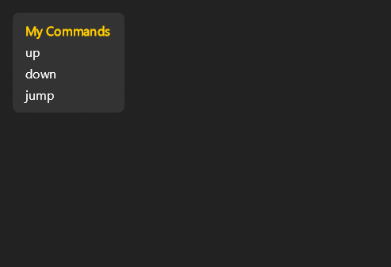
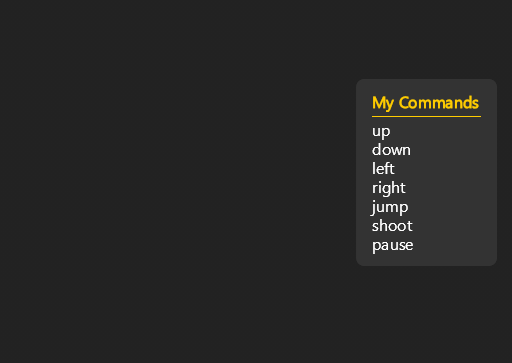
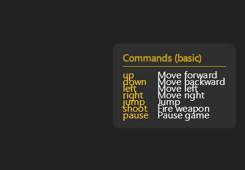

# 📜 Command Cheatsheet Tutorial

In this tutorial, you'll build a stateful command cheatsheet UI step by step, learning core concepts along the way.

## What You'll Build

A draggable, transparent command reference that can switch between different command sets using state.


> **Want to see the complete code?** Check out [examples/cheatsheet/cheatsheet_ui.py](../../examples/cheatsheet/cheatsheet_ui.py) for the final version. However, we recommend following along step by step to understand how it all comes together!

## Step 1: Create Your Starting Files

We'll create two files to get started. This gives you a working UI you can test right away!

### File 1: `cheatsheet_ui.py`

Create this file in your Talon user directory:

```python
# cheatsheet_ui.py
from talon import Module, actions

mod = Module()

def cheatsheet_ui():
    div, text, screen = actions.user.ui_elements(["div", "text", "screen"])

    return screen()[
        div(
            background_color="#333333",
            padding=16,
            margin=16,
            border_radius=8
        )[
            text("My Commands", color="#FFCC00", font_weight="bold"),
            text("up"),^
            text("down"),
            text("jump")
        ]
    ]

@mod.action_class
class Actions:
    def toggle_cheatsheet():
        """Toggle command cheatsheet"""
        actions.user.ui_elements_toggle(cheatsheet_ui)
```

### File 2: `cheatsheet_ui.talon`

Create this file in the same directory:

```talon
# cheatsheet_ui.talon
toggle cheatsheet: user.toggle_cheatsheet()
```

**Test it now!**

1. Save both files
2. Say "toggle cheatsheet" - your UI should appear!
3. Say "toggle cheatsheet" again - it disappears



> **From now on**, after each step you can save the file and say "toggle cheatsheet" twice to reload and see your changes!

## Step 2: Add Separator and Align to Right

Let's add a separator line and position the UI to the right side. This introduces **flexbox** concepts:

```python
# cheatsheet_ui.py
from talon import Module, actions

mod = Module()

def cheatsheet_ui():
    div, text, screen = actions.user.ui_elements(["div", "text", "screen"])

    return screen(flex_direction="row", justify_content="flex_end", align_items="center")[
        div(
            background_color="#333333",
            padding=16,
            margin=16,
            border_radius=8,
            gap=8
        )[
            text(
                "My Commands",
                color="#FFCC00",
                font_weight="bold",
                padding_bottom=8,
                border_bottom=1,
                border_color="#FFCC00"
            ),
            text("up"),
            text("down"),
            text("jump")
        ]
    ]

@mod.action_class
class Actions:
    def toggle_cheatsheet():
        """Toggle command cheatsheet"""
        actions.user.ui_elements_toggle(cheatsheet_ui)
```

**What's new?**

- `flex_direction="row"` changes the main axis to horizontal (so children flow left-to-right)
- `justify_content="flex_end"` pushes content to the right (along the main axis)
- `align_items="center"` centers content vertically (along the cross axis)
- `gap=8` sets tighter spacing between children (default `gap` is `16` for vertically aligned `text` elements, otherwise `0`)
- `padding_bottom=8`, `border_bottom=1`, `border_color="#FFCC00"` create the yellow underline

**Important: Everything is flexbox!**
- The default `flex_direction` is `"column"` (NOT `"row"`), so children stack vertically by default
- `justify_content` works along the main axis (vertical by default)
- `align_items` works along the cross axis (horizontal by default)
- Use `flex_direction="row"` to flip that behavior (main axis becomes horizontal, children flow left-to-right)

**Try it:** Save and reload to see the separator and right alignment!



## Step 3: Use Python Variables and the `*[...]` Pattern

Instead of manually typing each command, let's use a Python list and unpack it:

```python
# cheatsheet_ui.py
from talon import Module, actions

mod = Module()

def cheatsheet_ui():
    div, text, screen = actions.user.ui_elements(["div", "text", "screen"])

    commands = [
        "up",
        "down",
        "left",
        "right",
        "jump",
        "shoot",
        "pause"
    ]

    return screen(flex_direction="row", justify_content="flex_end", align_items="center")[
        div(
            background_color="#333333",
            padding=16,
            margin=16,
            border_radius=8,
            gap=8
        )[
            text(
                "My Commands",
                color="#FFCC00",
                font_weight="bold",
                padding_bottom=8,
                border_bottom=1,
                border_color="#FFCC00"
            ),
            *[text(command) for command in commands]
        ]
    ]

@mod.action_class
class Actions:
    def toggle_cheatsheet():
        """Toggle command cheatsheet"""
        actions.user.ui_elements_toggle(cheatsheet_ui)
```

**What's new?**

- `commands = [...]` creates a Python list of strings
- `*[text(command) for command in commands]` is a list comprehension with unpacking
- The `*` operator unpacks the list, so each `text()` element becomes a child
- This pattern is very common and powerful for dynamic lists!

**Try it:** Save and reload to see all seven commands!

## Step 4: Make It Transparent and Draggable

Let's add interactivity and transparency:

```python
# cheatsheet_ui.py
from talon import Module, actions

mod = Module()

def cheatsheet_ui():
    div, text, screen = actions.user.ui_elements(["div", "text", "screen"])

    commands = ["up", "down", "left", "right", "jump", "shoot", "pause"]

    return screen(flex_direction="row", justify_content="flex_end", align_items="center")[
        div(
            draggable=True,
            opacity=0.7,
            background_color="#333333",
            padding=16,
            margin=16,
            border_radius=8,
            gap=8
        )[
            text(
                "My Commands",
                color="#FFCC00",
                font_weight="bold",
                padding_bottom=8,
                border_bottom=1,
                border_color="#FFCC00"
            ),
            *[text(command) for command in commands]
        ]
    ]

@mod.action_class
class Actions:
    def toggle_cheatsheet():
        """Toggle command cheatsheet"""
        actions.user.ui_elements_toggle(cheatsheet_ui)
```

**What's new?**

- `draggable=True` lets you click and drag the UI anywhere on screen
- `opacity=0.7` makes it semi-transparent (0.0 = invisible, 1.0 = solid)
  - Alternative: You can add alpha directly to the color using 8-digit hex: `background_color="#333333B3"` (last 2 digits are alpha from `00` to `FF`, where `B3` ≈ 0.7)

**Try it:** Reload, then click and drag your cheatsheet around!

## Step 5: Use State to Show Different Command Sets

Now let's use **state** to toggle between different sets of commands. This is a key concept for dynamic UIs!

```python
# cheatsheet_ui.py
from talon import Module, actions

mod = Module()

def cheatsheet_ui():
    div, text, screen, state = actions.user.ui_elements(["div", "text", "screen", "state"])

    # Our state key is "mode", defaulting to string "basic"
    mode = state.get("mode", "basic")

    basic_commands = ["up", "down", "left", "right", "jump", "shoot", "pause"]
    advanced_commands = ["sprint", "crouch", "reload", "switch weapon", "use item"]

    # Choose commands based on mode
    commands = basic_commands if mode == "basic" else advanced_commands

    return screen(flex_direction="row", justify_content="flex_end", align_items="center")[
        div(
            draggable=True,
            opacity=0.7,
            background_color="#333333",
            padding=16,
            margin=16,
            border_radius=8,
            gap=8
        )[
            # Title shows current mode
            text(
                f"Commands ({mode})",
                color="#FFCC00",
                font_weight="bold",
                padding_bottom=8,
                border_bottom=1,
                border_color="#FFCC00"
            ),

            # Show commands
            *[text(cmd) for cmd in commands]
        ]
    ]

@mod.action_class
class Actions:
    def toggle_cheatsheet():
        """Toggle command cheatsheet"""
        actions.user.ui_elements_toggle(cheatsheet_ui)

    def cheatsheet_mode_basic():
        """Set cheatsheet to basic mode"""
        actions.user.ui_elements_set_state("mode", "basic")

    def cheatsheet_mode_advanced():
        """Set cheatsheet to advanced mode"""
        actions.user.ui_elements_set_state("mode", "advanced")
```

**Add voice commands** in `cheatsheet_ui.talon`:

```talon
# cheatsheet_ui.talon
toggle cheatsheet: user.toggle_cheatsheet()
cheatsheet basic: user.cheatsheet_mode_basic()
cheatsheet advanced: user.cheatsheet_mode_advanced()
```

**What's new?**

- `mode = state.get("mode", "basic")` gets state with key "mode", defaulting to "basic".
- `actions.user.ui_elements_set_state("mode", value)` updates the state from actions
- `*[text(cmd) for cmd in (...)]` uses the `*[...]` pattern to dynamically generate command list
- We can now control the mode with voice commands!

**Try it:**
1. Say "toggle cheatsheet" to show the UI
2. Say "cheatsheet advanced" to switch to advanced commands
3. Say "toggle cheatsheet" twice to reload and see the new mode

## Step 6: Convert to a Table Layout

If you want two column layout, then let's take Step 5 and convert it to use a **table**.

```python
# cheatsheet_ui.py
from talon import Module, actions

mod = Module()

def cheatsheet_ui():
    div, text, screen, state, table, tr, td = actions.user.ui_elements(["div", "text", "screen", "state", "table", "tr", "td"])

    # Get or create state to track which command set to show
    mode = state.get("mode", "basic")

    basic_commands = [
        ("up", "Move forward"),
        ("down", "Move backward"),
        ("left", "Move left"),
        ("right", "Move right"),
        ("jump", "Jump"),
        ("shoot", "Fire weapon"),
        ("pause", "Pause game")
    ]

    advanced_commands = [
        ("sprint", "Run faster"),
        ("crouch", "Duck down"),
        ("reload", "Reload weapon"),
        ("switch weapon", "Change weapon"),
        ("use item", "Use inventory item")
    ]

    # Choose commands based on mode
    commands = basic_commands if mode == "basic" else advanced_commands

    return screen(flex_direction="row", justify_content="flex_end", align_items="center")[
        div(
            draggable=True,
            opacity=0.7,
            background_color="#333333",
            padding=16,
            margin=16,
            border_radius=8,
            gap=8
        )[
            # Title
            text(
                f"Commands ({mode})",
                color="#FFCC00",
                font_weight="bold",
                padding_bottom=8,
                border_bottom=1,
                border_color="#FFCC00"
            ),

            # Table with commands
            table()[
                *[tr(padding=8)[
                    td(command, color="#FFCC00", padding_right=16),
                    td(description)
                ] for command, description in commands]
            ]
        ]
    ]

@mod.action_class
class Actions:
    def toggle_cheatsheet():
        """Toggle command cheatsheet"""
        actions.user.ui_elements_toggle(cheatsheet_ui)

    def cheatsheet_mode_basic():
        """Set cheatsheet to basic mode"""
        actions.user.ui_elements_set_state("mode", "basic")

    def cheatsheet_mode_advanced():
        """Set cheatsheet to advanced mode"""
        actions.user.ui_elements_set_state("mode", "advanced")
```

**What's new?**

- `table, tr, td` elements replace the simple text list
- Each command is now a **tuple** `(command, description)` with two parts
- `tr()` creates a table row
- `td()` creates a table cell (table data)
- `*[tr()[td(...), td(...)] for command, description in commands]` unpacks the list of rows
- `padding_right=16` adds spacing between the command and description columns
- Tables automatically align content in neat columns!

**Try it:** Save and reload to see your commands in a nice two-column table with descriptions!



## Step 7: Add Spacing with Style

Wait, the table looks a bit cramped! When we switched from `div` with `gap=8` to a table, we lost the spacing between rows. Let's use the **style** element to add padding:

```python
# cheatsheet_ui.py
from talon import Module, actions

mod = Module()

def cheatsheet_ui():
    div, text, screen, state = actions.user.ui_elements(["div", "text", "screen", "state"])
    table, tr, td, style = actions.user.ui_elements(["table", "tr", "td", "style"])

    # Get or create state to track which command set to show
    mode = state.get("mode", "basic")

    basic_commands = [
        ("up", "Move forward"),
        ("down", "Move backward"),
        ("left", "Move left"),
        ("right", "Move right"),
        ("jump", "Jump"),
        ("shoot", "Fire weapon"),
        ("pause", "Pause game")
    ]

    advanced_commands = [
        ("sprint", "Run faster"),
        ("crouch", "Duck down"),
        ("reload", "Reload weapon"),
        ("switch weapon", "Change weapon"),
        ("use item", "Use inventory item")
    ]

    # Choose commands based on mode
    commands = basic_commands if mode == "basic" else advanced_commands

    # Apply styles to all td elements and title
    style({
        "td": {
            "padding": 8
        },
        ".title": {
            "color": "#FFCC00",
            "font_weight": "bold",
            "padding_bottom": 8,
            "border_bottom": 1,
            "border_color": "#FFCC00"
        }
    })

    return screen(flex_direction="row", justify_content="flex_end", align_items="center")[
        div(
            draggable=True,
            opacity=0.7,
            background_color="#333333",
            padding=16,
            margin=16,
            border_radius=8,
            gap=8
        )[
            # Title
            text(f"Commands ({mode})", class_name="title"),

            # Table with commands
            table()[
                *[tr()[
                    td(command, color="#FFCC00", padding_right=16),
                    td(description)
                ] for command, description in commands]
            ]
        ]
    ]

@mod.action_class
class Actions:
    def toggle_cheatsheet():
        """Toggle command cheatsheet"""
        actions.user.ui_elements_toggle(cheatsheet_ui)

    def cheatsheet_mode_basic():
        """Set cheatsheet to basic mode"""
        actions.user.ui_elements_set_state("mode", "basic")

    def cheatsheet_mode_advanced():
        """Set cheatsheet to advanced mode"""
        actions.user.ui_elements_set_state("mode", "advanced")
```

**What's new?**

- `style = actions.user.ui_elements("style")` imports the style element
- `style({ "td": { "padding": 8 } })` applies padding to **all** `td` elements in this UI
- `style({ ".title": { ... } })` targets elements with `class_name="title"`
- This is called before the `return` statement
- Style lets you target elements by type (like `"td"`) or by class (like `".title"`)

**Try it:** Save and reload - now your table has nice breathing room between rows!

## 🎉 Congratulations!

You've built an interactive command cheatsheet! Here's what you learned:

- ✅ Creating basic UIs with `screen`, `div`, and `text`
- ✅ **Flexbox basics**: default `flex_direction="column"`, `justify_content`, `align_items`
- ✅ Using Python variables and the `*[...]` unpacking pattern
- ✅ Making UIs draggable and transparent
- ✅ **State management**: Creating reactive UIs that respond to user interaction
- ✅ **Tables**: Using `table`, `tr`, and `td` for structured data
- ✅ **Styling**: Using `style` to apply properties to multiple elements at once

## Key Concepts to Remember

1. **Everything is flexbox** - Children are laid out with flexbox rules
2. **Default flex_direction is "column"** - Items stack vertically by default
3. **Use `*[...]` for dynamic lists** - This pattern is essential for data-driven UIs
4. **State makes UIs reactive** - Use `state.get()` for reading state values
5. **Tables for structured data** - Use `table`, `tr`, `td` when you have columns of data
6. **Style for bulk styling** - Use `style()` to apply properties to all elements of a type

## What's Next?

### More Tutorials
- **[TODO List Tutorial](todo_list.md)** - Build a more complex stateful application
- **[Game Key Overlay](game_keys.md)** - Visual overlays for gaming
- **[Dashboard](dashboard.md)** - Build an interactive dashboard

### References
- **[Elements](../elements.md)** - All available elements (`div`, `button`, `table`, etc.)
- **[Properties](../properties.md)** - All styling properties (layout, colors, spacing, etc.)
- **[Actions](../actions.md)** - Talon voice actions for controlling UIs
- **[Icons](../icons.md)** - Available icon set

### Deep Dives
- **[State Concepts](../concepts/state.md)** - Deep dive into state management
- **[Components](../concepts/components.md)** - Reusable UI components
- **[Style](../concepts/style.md)** - Advanced styling techniques

### Example Code
- **[Complete Example](../../examples/cheatsheet/cheatsheet_ui.py)** - See the full featured version
