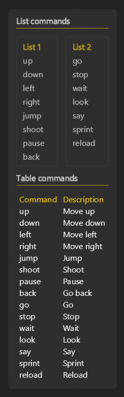

# 📜 Command Cheatsheet Tutorial

In this tutorial we will build a draggable transparent cheatsheet with 2 lists and 1 table, each with their own title.



## Step 1: See full code
See [examples/cheatsheet_ui.py](../../examples/cheatsheet_ui.py) for the complete code.

Say "elements test" to see examples in action.

## The Big Picture

This example is organized into 3 functions:
- `table_commands()` - Creates a table showing commands and descriptions
- `list_commands()` - Creates two side-by-side lists of commands
- `cheatsheet_ui()` - The main UI function that combines everything

**Focus here first:** `cheatsheet_ui()` is the main UI function that gets called with `actions.user.ui_elements_show(cheatsheet_ui)`.

## Understanding the Structure

### Getting Elements
All UI elements come from `actions.user.ui_elements()`:

```python
div, screen, text, style = actions.user.ui_elements(['div', 'screen', 'text', 'style'])
```

The order of returned elements will match the order you specify in the list. See [elements.md](../concepts/elements.md) for a full list of available elements.

**Important:** `screen` must always be the first element - it's the root container that fills the entire screen.

### Basic Element Syntax
Every element follows this pattern:
- **Properties** go in parentheses: `div(background_color="#333333", padding=16)`
- **Children** go in square brackets: `div()[...]`

```python
# Properties define how the element looks and behaves
div(background_color="#333333", padding=16)

# Children define what goes inside the element
div()[
    text("List commands"),
    list_commands(),
    text("Table commands"),
    table_commands()
]

# Combined: properties + children
div(background_color="#333333", padding=16)[
    text("Hello World")
]
```

## Breaking Down cheatsheet_ui()

Let's look at the main function step by step:

### 1. The Screen Layout
```python
return screen(flex_direction="row", align_items="center", justify_content="flex_end")
```
- `screen` fills the entire display
- `flex_direction="row"` means children lay out horizontally
- `justify_content="flex_end"` justify_content is the same axis as flex_direction, so this pushes content to the right side
- `align_items="center"` align_items is the perpendicular axis, so this centers content vertically

### 2. The Main Container
```python
div(
    draggable=True,
    flex_direction="column",
    opacity=0.7,
    margin=16,
    background_color="#333333",
    padding=16,
    gap=16,
    border_radius=8,
)
```
- `draggable=True` lets users move the cheatsheet around
- `flex_direction="column"` stacks children vertically
- `opacity=0.7` makes it slightly transparent
- `background_color="#333333"` gives it a dark gray background
- `padding=16` adds space inside the container
- `gap=16` adds space between children
- `border_radius=8` rounds the corners

### 3. The Content
```python
[
    text("List commands", class_name="title"),
    list_commands(),
    text("Table commands", class_name="title"),
    table_commands()
]
```
This creates the structure:
1. Title: "List commands"
2. The two side-by-side lists
3. Title: "Table commands"
4. The command table

## Styling with Classes

The tutorial uses a `style()` element to define reusable styles:

```python
style({
    ".title": {
        "font_weight": "bold",
        "font_size": 16,
        "color": "#FFFFFF",
        "padding_bottom": 8,
        "border_bottom": 1,
        "border_color": "#FFCC00"
    }
})
```

Then apply it with `class_name="title"`. This makes titles bold, white, with a yellow underline. Using style is optional, you can also apply styles directly to elements.

## Functions

### list_commands()
Creates two bordered boxes side by side:
```python
div(flex_direction="row", gap=16)[
    div(flex=1, padding=12, border_radius=4, border_color="#444444", border_width=1)[...],
    div(flex=1, padding=12, border_radius=4, border_color="#444444", border_width=1)[...]
]
```
- `flex_direction="row"` puts boxes side by side
- `flex=1` makes each try to be full width, so both boxes will share equal width. You can also do `justify_content="space_between"` to get the same effect.
- `gap=16` adds space between the boxes

### table_commands()
Creates a proper HTML table:
```python
table()[
    tr()[th()[text("Command")], th()[text("Description")]],
    *[tr()[td()[text(command)], td()[text(description)]] for command, description in commands_table.items()]
]
```
- `table` is the container
- `tr` is a table row
- `th` is a header cell
- `td` is a data cell
- `*[...]` is a common python pattern to unpack a list

## Using Your Cheatsheet

Show/hide the cheatsheet with:
```python
actions.user.ui_elements_show(cheatsheet_ui)
actions.user.ui_elements_hide(cheatsheet_ui)
actions.user.ui_elements_toggle(cheatsheet_ui)
```

## Next Steps

- See [hello_world.md](../tutorials/hello_world.md) for setting up voice commands
- Learn about [Properties](../concepts/properties.md) for styling elements
- Understand [State and Reactivity](../concepts/state.md) for dynamic UIs
- Explore [Components](../concepts/components.md) for reusable patterns
- Check [Talon Actions](../concepts/actions.md) for voice integration
