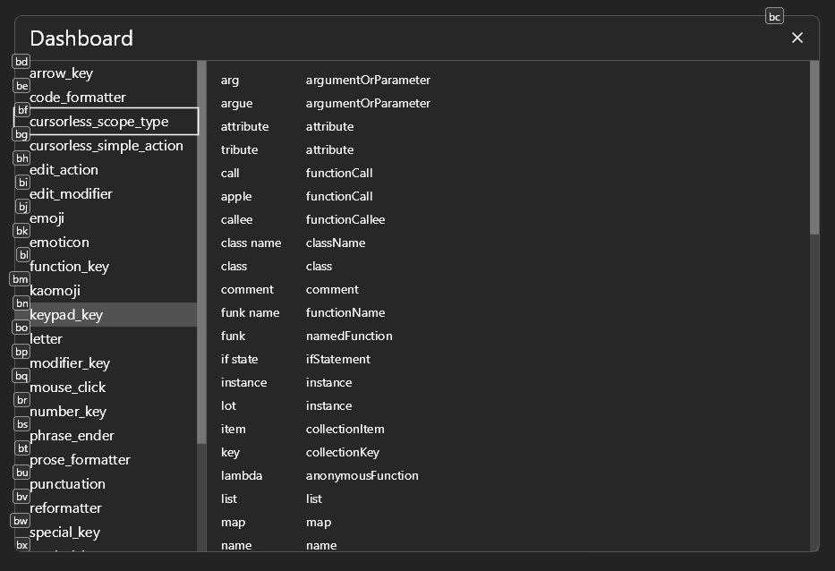

# 🧭 Dashboard Tutorial

In this tutorial we will build a draggable window dashboard that displays Talon user lists with a clickable sidebar for navigation.



## Step 1: See full code
See [examples/dashboard_ui.py](../../examples/dashboard_ui.py) for the complete code.

Say "elements test" to see examples in action.

## The Big Picture

This example is organized into 4 functions:
- `sidebar()` - Creates a clickable list of user lists on the left
- `body()` - Creates the main content area showing the selected list data
- `minimized_body()` - Defines what shows when the window is minimized
- `dashboard_ui()` - The main UI function that combines everything into a window

**Focus here first:** `dashboard_ui()` is the main UI function that gets called with `actions.user.ui_elements_show(dashboard_ui)`.

## Understanding the Structure

### Getting Elements
All UI elements come from `actions.user.ui_elements()`:

```python
window, screen = actions.user.ui_elements(["window", "screen"])
```

The order of returned elements will match the order you specify in the list. See [elements.md](../elements.md) for a full list of available elements.

**Important:** `screen` must always be the first element - it's the root container that fills the entire screen.

### Window Pattern
screen > window is a common pattern for creating windows.

Window by default is draggable, and has a title bar with a minimize and close button. If instead you want just a div that is draggable, you can use `div(draggable=True)` instead of `window`.

```python
screen(justify_content="center", align_items="center")[
    window(title="Dashboard", width=1100, height=700)[
        # window content goes here
    ]
]
```

- `screen` is like an invisible div that fills the entire display
- `justify_content="center", align_items="center"` is a common way to center anything.
- All elements are `flex_direction="column"` by default
- `justify_content` is for the primary axis (vertically in this case, since flex_direction is column).
- `align_items` is for the secondary axis (horizontally in this case).

### 2. The Window Container
```python
window(
    title="Dashboard",
    width=1100,
    height=700,
    flex_direction="row",
    minimized_body=minimized_body,
    minimized_style={
        "max_height": 400,
        "min_width": 200,
        "position": "absolute",
        "top": 100,
        "right": 100
    }
)
```
- `title="Dashboard"` -  in the window's title bar
- `width=1100, height=700` - sets the window size
- `flex_direction="row"` - Since `"column"` is the default `flex_direction`, we need to set this to `"row"` in order to arrange children horizontally instead of vertically.
- `minimized_body=minimized_body` - optional display when minimized. Since UI elements is just canvases, and not real windows, there is no true minimize functionality, so you may want to define what shows when minimized.
- `minimized_style` - optional control of style when minimized

## State Management

`state` is used for global state management to track which user list is currently selected. We can use `state.get`, `state.set`, and/or `state.use` from anywhere in the UI to manage state across UI updates.

```python
state = actions.user.ui_elements(["state"])
current_user_list = state.get("current_user_list", USER_LIST[0])
```

- `state.get("key", default)` gets a value or returns the default
- Because state is global, it can also be set with talon actions like `actions.user.ui_elements_set("key", value)`.

## Interactive Elements

### Buttons with Click Handlers
The sidebar creates clickable buttons:

```python
button(
    name,
    on_click=lambda e, name=name: state.set("current_user_list", name),
    padding=16,
    border_radius=4,
)
```

- `on_click` defines what happens when clicked
- `lambda e, name=name:` captures the button name for the click handler
- `state.set("key", value)` updates the global state, triggering a full UI refresh

### Table Display
The main content shows data in a table:

```python
table()[
    *[tr()[
        td(key),
        td(value)
    ] for key, value in key_vals.items()]
]
```

- `*[...]` is a common pattern in python to unpack a list comprehension

## Advanced Features

### Scrolling Content
Both sidebar and main content can scroll:

```python
div(overflow_y="scroll", height="100%")
```

- `overflow_y="scroll"` enables vertical scrolling
- `height="100%"` makes it fill available space

### Window Minimization
You can optionally define what the window looks like when minimized:

```python
minimized_body=minimized_body,
minimized_style={
    "position": "absolute",
    "top": 100,
    "right": 100
}
```

You can also disable minimize functionality by hiding the minimize button `show_minimize=False`.

## Using Your Dashboard

Show/hide the dashboard with:
```python
actions.user.ui_elements_show(dashboard_ui)
actions.user.ui_elements_hide(dashboard_ui)
actions.user.ui_elements_toggle(dashboard_ui)
```

## Next Steps

- See [hello_world.md](../tutorials/hello_world.md) for setting up voice commands
- Learn about [State and Reactivity](../concepts/state.md) for dynamic UIs
- Understand [Properties](../properties.md) for styling elements
- Check [Talon Actions](../actions.md) for voice integration