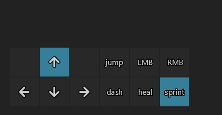

# 🎮 Game Key Overlay Tutorial

Build a visual overlay showing game controls that you can toggle on and off during gameplay. Perfect for learning new games or streaming!

## What You'll Build

A translucent overlay showing keyboard controls positioned in the corner of your screen, exactly like what you see in many modern games.



## Step 1: Start with a simple WASD UI

Let's begin with a basic key display. Create `game_ui.py`:

```python
from talon import actions

def key(id, label):
    div, text = actions.user.ui_elements(["div", "text"])

    return div(padding=16)[
        text(label, id=id)
    ]

def game_keys_ui():
    div, text, screen = actions.user.ui_elements(["div", "text", "screen"])

    return screen()[
        div()[
            key("W", "W"),
            key("A", "A"),
            key("S", "S"),
            key("D", "D"),
        ]
    ]
```

## Step 2: Setup talon actions
Let's create Talon actions for gaming and key presses.

Add the following to your `game_ui.py`:

```python
from talon import Module, actions

mod = Module()

def key():
    # Content from above

def game_keys_ui():
    # Content from above

dir_keys = ["a", "s", "d", "w"]

@mod.action_class
class Actions:
    def game_nameofgame_toggle_ui():
        """Toggle game ui overlay"""
        actions.user.ui_elements_toggle(game_nameofgame_keys_ui)

    def game_nameofgame_press_key(key_id: str):
        """Press a specific key"""
        actions.key.press(key_id)
        actions.user.ui_elements_highlight_briefly(key_id)

    def game_nameofgame_hold_dir_key(key_id: str):
        """Go in a specific direction"""
        for key in dir_keys:
            if key == key_id:
                actions.user.ui_elements_highlight(key)
            else:
                actions.user.ui_elements_unhighlight(key)

    def game_nameofgame_release_dir_key(key_id: str):
        """Release a specific direction key"""
        actions.user.ui_elements_unhighlight(key_id)

    def game_nameofgame_release_dir_keys():
        """Release a specific direction key"""
        for key in dir_keys:
            actions.user.ui_elements_unhighlight(key)

    def game_nameofgame_toggle():
        """Toggle game key overlay"""
        actions.user.game_nameofgame_release_dir_keys()
        actions.user.ui_elements_toggle(game_nameofgame_keys_ui)
```


Create `game.talon`:

```talon
game mode: user.game_nameofgame_toggle()
go left: user.game_nameofgame_hold_dir_key("a")
go right: user.game_nameofgame_hold_dir_key("d")
go forward: user.game_nameofgame_hold_dir_key("w")
go backward: user.game_nameofgame_hold_dir_key("s")
stop: user.game_nameofgame_release_dir_keys()

**What we have:** A basic list of controls. Not very game-like yet!

## Step 2: Position It Like a Real Game Overlay

Game overlays usually sit in a corner. Let's move ours to the bottom-left:

```python
from talon import actions

def game_keys_ui():
    div, text, screen = actions.user.ui_elements(["div", "text", "screen"])

    return screen(justify_content="flex_start", align_items="flex_end")[
        div(
            margin=20,
            background_color="000000AA",  # Semi-transparent black
            padding=16,
            border_radius=8
        )[
            text("W - Forward", color="FFFFFF"),
            text("A - Left", color="FFFFFF"),
            text("S - Backward", color="FFFFFF"),
            text("D - Right", color="FFFFFF")
        ]
    ]
```

**What's new?**

- `justify_content="flex_start"` positions at the left
- `align_items="flex_end"` positions at the bottom
- `margin=20` adds space from the screen edge
- `background_color="000000AA"` - the "AA" makes it semi-transparent
- `color="FFFFFF"` makes text white for contrast

## Step 3: Make Individual Key Components

Real game overlays show individual keys. Let's create a reusable key component:

```python
from talon import actions

def key_display(key, description):
    div, text = actions.user.ui_elements(["div", "text"])

    return div(
        flex_direction="row",
        align_items="center",
        gap=12
    )[
        # The key itself
        div(
            background_color="333333",
            border="1px solid #666666",
            border_radius=4,
            padding=8,
            min_width=32,
            justify_content="center"
        )[
            text(key, color="FFFFFF", font_weight="bold")
        ],
        # The description
        text(description, color="FFFFFF")
    ]

def game_keys_ui():
    div, screen = actions.user.ui_elements(["div", "screen"])

    return screen(justify_content="flex_start", align_items="flex_end")[
        div(
            margin=20,
            background_color="000000CC",
            padding=16,
            border_radius=8,
            gap=8
        )[
            key_display("W", "Forward"),
            key_display("A", "Left"),
            key_display("S", "Backward"),
            key_display("D", "Right")
        ]
    ]
```

**What's new?**

- `key_display()` is a reusable component function
- `flex_direction="row"` puts the key and description side by side
- `gap=12` adds spacing between the key box and description
- `min_width=32` ensures keys are at least 32 pixels wide
- `border="1px solid #666666"` adds a subtle border to keys

## Step 4: Add Icons for Visual Appeal

Icons make overlays look more professional. Let's add some:

```python
from talon import actions

def key_with_icon(key, icon_name, description):
    div, text, icon = actions.user.ui_elements(["div", "text", "icon"])

    return div(
        flex_direction="row",
        align_items="center",
        gap=12
    )[
        # The key
        div(
            background_color="333333",
            border="1px solid #666666",
            border_radius=4,
            padding=8,
            min_width=32,
            justify_content="center"
        )[
            text(key, color="FFFFFF", font_weight="bold", font_size=14)
        ],
        # Icon and description
        div(flex_direction="row", align_items="center", gap=8)[
            icon(icon_name, size=16, fill="FFFFFF"),
            text(description, color="FFFFFF")
        ]
    ]

def game_keys_ui():
    div, screen = actions.user.ui_elements(["div", "screen"])

    return screen(justify_content="flex_start", align_items="flex_end")[
        div(
            margin=20,
            background_color="000000CC",
            padding=16,
            border_radius=8,
            gap=8
        )[
            key_with_icon("W", "arrow_upward", "Forward"),
            key_with_icon("A", "arrow_back", "Left"),
            key_with_icon("S", "arrow_downward", "Backward"),
            key_with_icon("D", "arrow_forward", "Right")
        ]
    ]
```

**What's new?**

- `icon()` element displays built-in icons
- `size=16` sets the icon size
- `fill="FFFFFF"` colors the icon white
- Icons use names like "arrow_upward", "arrow_back", etc.

## Step 5: Add More Game Controls

Let's expand to show common gaming controls:

```python
from talon import actions

def key_with_icon(key, icon_name, description):
    div, text, icon = actions.user.ui_elements(["div", "text", "icon"])

    return div(
        flex_direction="row",
        align_items="center",
        gap=12
    )[
        div(
            background_color="333333",
            border="1px solid #666666",
            border_radius=4,
            padding=8,
            min_width=32,
            justify_content="center"
        )[
            text(key, color="FFFFFF", font_weight="bold", font_size=14)
        ],
        div(flex_direction="row", align_items="center", gap=8)[
            icon(icon_name, size=16, fill="FFFFFF"),
            text(description, color="FFFFFF")
        ]
    ]

def simple_key(key, description):
    div, text = actions.user.ui_elements(["div", "text"])

    return div(
        flex_direction="row",
        align_items="center",
        gap=12
    )[
        div(
            background_color="333333",
            border="1px solid #666666",
            border_radius=4,
            padding=8,
            min_width=32,
            justify_content="center"
        )[
            text(key, color="FFFFFF", font_weight="bold", font_size=14)
        ],
        text(description, color="FFFFFF")
    ]

def game_keys_ui():
    div, screen, text = actions.user.ui_elements(["div", "screen", "text"])

    return screen(justify_content="flex_start", align_items="flex_end")[
        div(
            margin=20,
            background_color="000000CC",
            padding=16,
            border_radius=8,
            gap=8
        )[
            text("Game Controls", color="FFFFFF", font_weight="bold", margin_bottom=8),

            # Movement
            key_with_icon("W", "arrow_upward", "Forward"),
            key_with_icon("A", "arrow_back", "Left"),
            key_with_icon("S", "arrow_downward", "Backward"),
            key_with_icon("D", "arrow_forward", "Right"),

            # Divider
            div(height=1, background_color="666666", margin_top=8, margin_bottom=8),

            # Actions
            simple_key("Space", "Jump"),
            simple_key("Shift", "Run"),
            simple_key("E", "Interact"),
            simple_key("Tab", "Map")
        ]
    ]
```

**What's new?**

- Added a title with `font_weight="bold"`
- Created `simple_key()` for keys without icons
- Added a visual divider between sections
- `margin_bottom=8` adds space below the title
- Used `height=1` to create a thin divider line

## Step 6: Add Show/Hide Controls

Finally, let's add the ability to toggle the overlay:

```python
from talon import Module, actions

mod = Module()

# ... (include all the component functions from Step 5) ...

@mod.action_class
class Actions:
    def show_game_keys():
        """Show game key overlay"""
        actions.user.ui_elements_show(game_keys_ui)

    def hide_game_keys():
        """Hide game key overlay"""
        actions.user.ui_elements_hide_all()

    def toggle_game_keys():
        """Toggle game key overlay"""
        # This will show if hidden, hide if shown
        actions.user.ui_elements_toggle(game_keys_ui)
```

Create `game_keys.talon`:

```talon
show game keys: user.show_game_keys()
hide game keys: user.hide_game_keys()
toggle game keys: user.toggle_game_keys()
```

## 🎉 You Did It!

You've built a professional-looking game overlay! Here's what you learned:

- ✅ **Component patterns** - Breaking UI into reusable pieces
- ✅ **Positioning** - Using flexbox to place elements exactly where you want
- ✅ **Transparency** - Creating overlays that don't block your game
- ✅ **Icons** - Adding visual elements for better UX
- ✅ **Layout techniques** - Grouping, spacing, and organizing content

## Advanced Challenges

Ready for more? Try these modifications:

1. **Make it draggable** - Add `draggable=True` to the main div
2. **Different positions** - Try top-right, center, or custom positioning
3. **Game-specific keys** - Customize for your favorite game
4. **Dynamic updates** - Use `state` to change controls based on game mode
5. **Styling themes** - Create different color schemes

## Next Tutorial

Ready for something interactive? Try the **[Command Cheatsheet](command_cheatsheet.md)** tutorial to build a dynamic reference that updates based on your current context!
