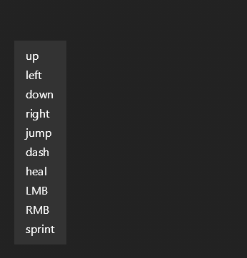
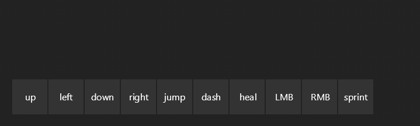
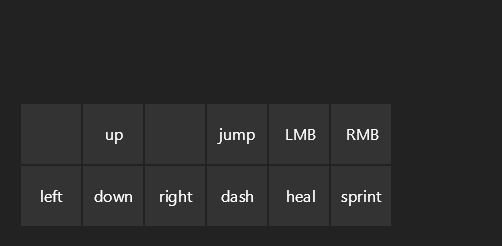

# 🎮 Game Key Overlay Tutorial

In this tutorial, you'll build a visual game control overlay step by step, learning about reusable functions, flexbox grid layouts, and interactive highlighting along the way.

## What You'll Build

A transparent overlay showing game controls with arrow keys and action buttons, positioned at the bottom-left of your screen.


> **Want to see the complete code?** Check out [examples/game_keys/game_keys_ui.py](../../examples/game_keys/game_keys_ui.py) for the final version. However, we recommend following along step by step to understand how it all comes together!

## Step 1: Create Your Starting Files with All Content

Let's start by displaying all the keys we'll need - both action keys and directional controls as simple text.

### File 1: `game_keys_ui.py`

Create this file in your Talon user directory:

```python
# game_keys_ui.py
from talon import Module, actions

mod = Module()

def game_keys_ui():
    screen, div, text = actions.user.ui_elements(["screen", "div", "text"])

    return screen(justify_content="flex_end")[
        div(background_color="#333333", padding=16, margin=20)[
            text("up"),
            text("left"),
            text("down"),
            text("right"),
            text("jump"),
            text("dash"),
            text("heal"),
            text("LMB"),
            text("RMB"),
            text("sprint"),
        ]
    ]

@mod.action_class
class Actions:
    def toggle_game_keys():
        """Toggle game key overlay"""
        actions.user.ui_elements_toggle(game_keys_ui)
```

### File 2: `game_keys_ui.talon`

Create this file in the same directory:

```talon
# game_keys_ui.talon
toggle game keys: user.toggle_game_keys()
```

**Test it now!**

1. Save both files
2. Say "toggle game keys" - your UI should appear at the bottom-left!
3. Say "toggle game keys" again - it disappears



> **From now on**, after each step you can save the file and say "toggle game keys" twice to reload and see your changes!

**Understanding flexbox positioning:**

Unlike HTML, **all UI elements default to `flex_direction="column"`** (vertical stacking). This means:
- `justify_content` controls vertical positioning (top to bottom)
- `align_items` controls horizontal positioning (left to right)

If you prefer horizontal-first layout like HTML, you can use `flex_direction="row"`, which flips these: `justify_content` becomes horizontal and `align_items` becomes vertical.

**Note on other positioning options:**

```python
# Bottom-left (current)
screen(justify_content="flex_end")

# Top-left
screen(justify_content="flex_start") # or screen()

# Bottom-right
screen(justify_content="flex_end", align_items="flex_end")

# Top-right
screen(justify_content="flex_start", align_items="flex_end")

# Center
screen(justify_content="center", align_items="center")
```


## Step 2: Make Keys Look Like Keys with Style

Let's use `class_name` and `style` to make them look like button-like keys:

```python
# game_keys_ui.py
from talon import Module, actions

mod = Module()

def game_keys_ui():
    screen, div, text, style = actions.user.ui_elements(["screen", "div", "text", "style"])

    style({
        ".key": {
            "padding": 8,
            "background_color": "#333333",
            "margin": 1,
            "width": 60,
            "height": 60,
            "justify_content": "center",
            "align_items": "center"
        }
    })

    return screen(justify_content="flex_end")[
        div(margin=20, flex_direction="row")[
            div(class_name="key")[text("up")],
            div(class_name="key")[text("left")],
            div(class_name="key")[text("down")],
            div(class_name="key")[text("right")],
            div(class_name="key")[text("jump")],
            div(class_name="key")[text("dash")],
            div(class_name="key")[text("heal")],
            div(class_name="key")[text("LMB")],
            div(class_name="key")[text("RMB")],
            div(class_name="key")[text("sprint")],
        ]
    ]

@mod.action_class
class Actions:
    def toggle_game_keys():
        """Toggle game key overlay"""
        actions.user.ui_elements_toggle(game_keys_ui)
```

**What's new?**

- `class_name="key"` marks elements with a CSS-like class
- `style({ ".key": { ... } })` applies properties to all elements with that class
- `width=60, height=60` makes square keys
- `justify_content="center", align_items="center"` centers the text inside each key
- `margin=1` adds tiny spacing between keys

**Important pattern:** Using `style()` with `class_name` avoids repetition!



**Try it:** Save and reload to see button-like keys in a vertical column!

## Step 3: Organize Keys into a Grid Layout

Let's arrange the keys into their proper grid layout - directional arrows in an inverted-T and action keys in two rows:

```python
# game_keys_ui.py
from talon import Module, actions

mod = Module()

def game_keys_ui():
    screen, div, text, style = actions.user.ui_elements(["screen", "div", "text", "style"])

    style({
        ".key": {
            "padding": 8,
            "background_color": "#333333",
            "margin": 1,
            "width": 60,
            "height": 60,
            "justify_content": "center",
            "align_items": "center"
        }
    })

    return screen(justify_content="flex_end")[
        div(flex_direction="row", margin=20)[
            # Arrow keys section
            div()[
                div(flex_direction="row")[
                    div(class_name="key")[text(" ")],
                    div(class_name="key")[text("up")],
                    div(class_name="key")[text(" ")]
                ],
                div(flex_direction="row")[
                    div(class_name="key")[text("left")],
                    div(class_name="key")[text("down")],
                    div(class_name="key")[text("right")]
                ]
            ],
            # Action keys section
            div()[
                div(flex_direction="row")[
                    div(class_name="key")[text("jump")],
                    div(class_name="key")[text("LMB")],
                    div(class_name="key")[text("RMB")],
                ],
                div(flex_direction="row")[
                    div(class_name="key")[text("dash")],
                    div(class_name="key")[text("heal")],
                    div(class_name="key")[text("sprint")],
                ]
            ]
        ]
    ]

@mod.action_class
class Actions:
    def toggle_game_keys():
        """Toggle game key overlay"""
        actions.user.ui_elements_toggle(game_keys_ui)
```

**What's new?**

- `div(flex_direction="row")` on the outer container places arrow keys and action keys side-by-side
- Each section has nested rows for creating the grid layout
- Arrow keys arranged in inverted-T: one key on top, three on bottom
- Action keys arranged in a 3x2 grid

**Try it:** Save and reload to see your organized key layout!



## Step 4: Add Interactive Highlighting

Let's add the ability to highlight keys during gameplay for real-time feedback. We'll give each key a unique ID:

```python
# game_keys_ui.py
from talon import Module, actions

mod = Module()

def game_keys_ui():
    screen, div, text, style = actions.user.ui_elements(["screen", "div", "text", "style"])

    style({
        ".key": {
            "padding": 8,
            "background_color": "#333333",
            "margin": 1,
            "width": 60,
            "height": 60,
            "justify_content": "center",
            "align_items": "center",
            "highlight_style": {
                "background_color": "#44BCE7",
            }
        }
    })

    return screen(justify_content="flex_end")[
        div(flex_direction="row", margin=20)[
            # Arrow keys section
            div()[
                div(flex_direction="row")[
                    div(class_name="key")[text(" ")],
                    div(class_name="key", id="up")[text("up")],
                    div(class_name="key")[text(" ")]
                ],
                div(flex_direction="row")[
                    div(class_name="key", id="left")[text("left")],
                    div(class_name="key", id="down")[text("down")],
                    div(class_name="key", id="right")[text("right")]
                ]
            ],
            # Action keys section
            div()[
                div(flex_direction="row")[
                    div(class_name="key", id="space")[text("jump")],
                    div(class_name="key", id="lmb")[text("LMB")],
                    div(class_name="key", id="rmb")[text("RMB")],
                ],
                div(flex_direction="row")[
                    div(class_name="key", id="q")[text("dash")],
                    div(class_name="key", id="e")[text("heal")],
                    div(class_name="key", id="shift")[text("sprint")],
                ]
            ]
        ]
    ]

@mod.action_class
class Actions:
    def toggle_game_keys():
        """Toggle game key overlay"""
        actions.user.ui_elements_toggle(game_keys_ui)
```

**What's new?**

- Each key now has a unique `id` (like "up", "space", "q")
- `highlight_style` is the property we use to optionally customize how highlighted keys look (cyan background)
- Three UI elements actions available for interactive highlighting:
  - `user.ui_elements_highlight(id)` - Turn on highlight
  - `user.ui_elements_unhighlight(id)` - Turn off highlight
  - `user.ui_elements_highlight_briefly(id)` - Flash highlight then fade

**Try it:** Update your `.talon` file to see highlights in action:

```talon
# game_keys_ui.talon
toggle game keys: user.toggle_game_keys()

# Flash keys briefly when pressing them
test jump:
    user.ui_elements_highlight_briefly("space")
    key(space)

test dash:
    user.ui_elements_highlight_briefly("q")
    key(q)

test heal:
    user.ui_elements_highlight_briefly("e")
    key(e)

# Hold highlight while shift is pressed
test sprint:
    user.ui_elements_highlight("shift")
    key(shift:down)

test sprint release:
    user.ui_elements_unhighlight("shift")
    key(shift:up)
```

Now say "test jump" or "test dash" to see keys flash, or "test sprint" to see the shift key stay highlighted until you say "test sprint release"!


**Why highlighting instead of state?**

We could use state to change key colors, but **highlighting is more performant** for real-time feedback. Highlighting uses the decoration layer instead of triggering full UI re-renders.

## Step 5: Replace Directions with Icons and Use Reusable Functions

Let's replace the direction text with arrow icons and create reusable functions to avoid repetition:

```python
# game_keys_ui.py
from talon import Module, actions

mod = Module()

def key(id: str, display: str):
    div, text = actions.user.ui_elements(["div", "text"])
    return div(class_name="key", id=id)[text(display)]

def key_icon(id: str, icon_name: str):
    div, icon = actions.user.ui_elements(["div", "icon"])
    return div(class_name="key", id=id)[
        icon(icon_name, fill="FFFFFF", stroke="000000", stroke_width=3, size=30)
    ]

def game_keys_ui():
    screen, div, style = actions.user.ui_elements(["screen", "div", "style"])

    style({
        ".key": {
            "padding": 8,
            "background_color": "#333333",
            "margin": 1,
            "width": 60,
            "height": 60,
            "justify_content": "center",
            "align_items": "center",
            "highlight_style": {
                "background_color": "#44BCE799",
            }
        }
    })

    return screen(justify_content="flex_end")[
        div(flex_direction="row", margin=20)[
            # Arrow keys section
            div()[
                div(flex_direction="row")[
                    key("blank1", " "),
                    key_icon("up", "arrow_up"),
                    key("blank2", " ")
                ],
                div(flex_direction="row")[
                    key_icon("left", "arrow_left"),
                    key_icon("down", "arrow_down"),
                    key_icon("right", "arrow_right")
                ]
            ],
            # Action keys section
            div()[
                div(flex_direction="row")[
                    key("space", "jump"),
                    key("lmb", "LMB"),
                    key("rmb", "RMB"),
                ],
                div(flex_direction="row")[
                    key("q", "dash"),
                    key("e", "heal"),
                    key("shift", "sprint"),
                ]
            ]
        ]
    ]

@mod.action_class
class Actions:
    def toggle_game_keys():
        """Toggle game key overlay"""
        actions.user.ui_elements_toggle(game_keys_ui)

    def highlight_game_key(key_id: str):
        """Highlight a game key"""
        actions.user.ui_elements_highlight(key_id)

    def unhighlight_game_key(key_id: str):
        """Unhighlight a game key"""
        actions.user.ui_elements_unhighlight(key_id)

    def highlight_briefly_game_key(key_id: str):
        """Briefly flash a game key"""
        actions.user.ui_elements_highlight_briefly(key_id)
```

**What's new?**

- `key(id, display)` and `key_icon(id, icon_name)` are **reusable function helpers** that return UI elements
- These are **not components** - just regular Python functions that help organize our code
- **UI elements are composable** - you can use these functions anywhere in your UI tree
- Arrow directions now use icons: `arrow_up`, `arrow_left`, `arrow_down`, `arrow_right`
- `icon()` element with `fill`, `stroke`, `stroke_width`, and `size` properties
- `highlight_style` now has alpha transparency (`99` at the end = semi-transparent cyan)

> **Want to see all available icons?** Check out the **[Icons reference](../icons.md)** for the complete list!

**Try it:** Save and reload to see arrow icons instead of text!

## Final Code

Here's the complete, polished version with all the improvements:

```python
# game_keys_ui.py
from talon import actions

def key(id, display: str):
    div, text = actions.user.ui_elements(["div", "text"])
    return div(class_name="key", id=id)[text(display)]

def key_icon(id, icon_name):
    div, icon = actions.user.ui_elements(["div", "icon"])
    return div(class_name="key", id=id)[
        icon(icon_name, fill="FFFFFF", stroke="000000", stroke_width=3, size=30)
    ]

def blank_key():
    div, text = actions.user.ui_elements(["div", "text"])
    return div(class_name="key", opacity=0.6)[text(" ")]

def game_keys_ui():
    screen, div, style = actions.user.ui_elements(["screen", "div", "style"])

    style({
        "text": {
            "stroke_color": "000000",
            "stroke_width": 4
        },
        ".key": {
            "padding": 8,
            "background_color": "#33333366",
            "flex_direction": "row",
            "justify_content": "center",
            "align_items": "center",
            "margin": 1,
            "width": 60,
            "height": 60,
            "opacity": 0.8,
            "highlight_style": {
                "background_color": "#44BCE799",
            },
        }
    })

    return screen(justify_content="flex_end")[
        div(flex_direction="row", margin=20)[
            div()[
                div(flex_direction="row")[
                    blank_key(),
                    key_icon("up", "arrow_up"),
                    blank_key()
                ],
                div(flex_direction="row")[
                    key_icon("left", "arrow_left"),
                    key_icon("down", "arrow_down"),
                    key_icon("right", "arrow_right")
                ]
            ],
            div()[
                div(flex_direction="row")[
                    key("space", "jump"),
                    key("lmb", "LMB"),
                    key("rmb", "RMB"),
                ],
                div(flex_direction="row")[
                    key("q", "dash"),
                    key("e", "heal"),
                    key("shift", "sprint"),
                ]
            ],
        ],
    ]

def toggle_game_keys():
    actions.user.ui_elements_toggle(game_keys_ui)
```

**Final touches:**

- `blank_key()` function adds invisible spacers to center the up arrow
- Text has a black outline (`stroke_color` and `stroke_width`) for better visibility
- `background_color="#33333366"` - the `66` at the end adds alpha/transparency
- `opacity=0.8` makes the entire key semi-transparent (two ways to add transparency!)
- Semi-transparent cyan highlight that doesn't block your view

**Try it:** Save and reload - your overlay is now complete and polished!


## 🎉 Congratulations!

You've built a professional game key overlay! Here's what you learned:

- ✅ Using `class_name` and `style` for consistent styling
- ✅ Using `actions.user.ui_elements_highlight()` to target `id`s for elements
- ✅ Creating reusable function helpers (`key()`, `key_icon()`, `blank_key()`)
- ✅ Building grid layouts with nested flexbox containers
- ✅ Making transparent overlays with color alpha and opacity
- ✅ Positioning UIs with `justify_content` and `align_items`

## What's Next?

### More Tutorials
- **[Hello World](hello_world.md)** - Start with the basics
- **[Cheatsheet](cheatsheet.md)** - Learn state management and tables

### References
- **[Elements](../elements.md)** - All available elements
- **[Properties](../properties.md)** - All styling properties
- **[Icons](../icons.md)** - Available icon set
- **[Actions](../actions.md)** - Controlling UIs with voice

### Deep Dives
- **[Style](../concepts/style.md)** - Advanced styling techniques
- **[Rendering](../concepts/rendering.md)** - How highlighting works
- **[SVG](../concepts/svgs.md)** - Working with SVG elements

### Example Code
- **[Complete Example](../../examples/game_keys/game_keys_ui.py)** - See the full version