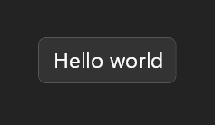

# Your First UI in 5 Minutes

Welcome to UI Elements! In this tutorial, you'll create your first voice-activated UI from scratch.

## What You'll Build

A simple "Hello World" UI that you can show and hide with voice commands.



## Step 1: Create Your First File

Create a new file in your Talon user directory called `hello_world.py`:

> **Note:** Not sure where your Talon user directory is? On Mac/Linux it's `~/.talon/user`. On Windows it's `~/AppData/Roaming/talon/user`. You can put a file anywhere inside the `user` folder, including subfolders.

```python
# hello_world.py
from talon import actions

def hello_world_ui():
    div, text, screen = actions.user.ui_elements(["div", "text", "screen"])

    return screen()[
        div()[
            text("Hello world")
        ]
    ]
```

**What's happening here?**

- First, we create a function called `hello_world_ui` that will return our UI. It must return a tree of elements composed with `actions.user.ui_elements()`.
- `actions.user.ui_elements()` gives us the building blocks we need.
- `screen()` is like the canvas - it fills your entire screen
- `div()` is like a standard HTML `<div>` - a generic container
- `text()` displays text content
- The `[]` after each element contains its children
- The `()` after each element contains its styling (we'll add that next)

## Step 2: Add Some Style

Let's make it look better by adding styling inside the parentheses:

```python
# hello_world.py
from talon import actions

def hello_world_ui():
    div, text, screen = actions.user.ui_elements(["div", "text", "screen"])

    return screen(justify_content="center", align_items="center")[
        div(background_color="#333333", padding=16, border_radius=8)[
            text("Hello world", font_size=24, color="#FFFFFF")
        ]
    ]
```

**What's new?**

- `justify_content="center"` and `align_items="center"` center the div on screen
- `background_color="#333333"` gives the div a dark gray background
- `padding=16` adds space inside the div around the text
- `border_radius=8` rounds the corners
- `font_size=24` makes the text bigger
- `color="#FFFFFF"` makes the text white

Notice that most properties use standard CSS-like names and values. Just replace dashes with underscores (e.g., `background-color` becomes `background_color`).

## Step 3: Add Show/Hide Functions

Now let's add functions to show and hide the UI:

```python
# hello_world.py
from talon import Module, actions

mod = Module()

def hello_world_ui():
    div, text, screen = actions.user.ui_elements(["div", "text", "screen"])

    return screen(justify_content="center", align_items="center")[
        div(background_color="333333", padding=16, border_radius=8)[
            text("Hello world", font_size=24, color="FFFFFF")
        ]
    ]

@mod.action_class
class Actions:
    def show_hello_world():
        """Show hello world UI"""
        actions.user.ui_elements_show(hello_world_ui)

    def hide_hello_world():
        """Hide hello world UI"""
        actions.user.ui_elements_hide(hello_world_ui)
```

**What's new?**

Using `Module()` and `@mod.action_class` is the standard way to define new Talon actions that will be available on the `user.` namespace, so this adds `user.show_hello_world()` and `user.hide_hello_world()` actions.

- `actions.user.ui_elements_show()` is how we show any UI built with `user.ui_elements()`
- `actions.user.ui_elements_hide()` hides the UI

Alternatively, instead of making 2 actions, we can use `actions.user.ui_elements_toggle()` to toggle visibility with one action.

## Step 4: Add Voice Commands

Create a second file called `hello_world.talon` to add voice commands:

```talon
# hello_world.talon
show hello world: user.show_hello_world()
hide hello world: user.hide_hello_world()
```

**What's happening?**

- When you say "show hello world", it calls `user.show_hello_world()`
- When you say "hide hello world", it calls `user.hide_hello_world()`

## Step 5: Test It Out!

1. Save both files
2. Say "show hello world" - your UI should appear!
3. Say "hide hello world" - it should disappear

## Step 6: Troubleshooting
If it doesn't work:
- Check the Talon log for errors. You can right click the Talon icon in the system tray, select "Scripting" > "View Log", and check for errors. Or say "talon open log".
- Make sure both files are saved in your Talon user directory
- Try saving the files again to reload them

## 🎉 Congratulations!

You've created your first UI! Here's what you accomplished:

- ✅ Created a renderer function `hello_world_ui`
- ✅ Used `screen`, `div`, and `text` elements
- ✅ Added styling with properties
- ✅ Connected it to Talon actions
- ✅ Added voice commands

## Next Steps

Check out the elements and properties documentation for a full list of what you can use.
- **[Elements](../elements.md)**
- **[Properties](../properties.md)**

Now that you understand the basics, try these tutorials:

- **[Command Cheatsheet](cheatsheet.md)** - Create a dynamic command reference
- **[Game Key Overlay](game_key_overlay.md)** - Build a visual key overlay for gaming
- **[TODO List](todo_list.md)** - Build an interactive task manager

## Resources
**Need help?**
- Look at the [concepts documentation](../concepts/) for deeper understanding
