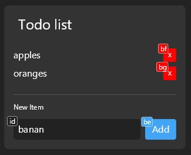

# 📝 TODO List Tutorial

Build a fully interactive task manager with real-time updates, input fields, and dynamic state management. This tutorial covers the most advanced UI patterns!

## What You'll Build

A complete todo list with add/remove functionality, text input, and persistent state that responds to voice commands.



## What You'll Learn

- Text input handling with `input_text` and `ref`
- Button interactions and event handling
- Complex state management patterns
- List manipulation and dynamic rendering
- Creating interactive, stateful UIs

## Step 1: Basic Static Todo List

Let's start with a simple list of tasks. Create `todo_list.py`:

```python
from talon import actions

def todo_list_ui():
    div, text, screen = actions.user.ui_elements(["div", "text", "screen"])

    tasks = [
        "Learn UI Elements",
        "Build my first app",
        "Master voice coding"
    ]

    return screen(justify_content="center", align_items="center")[
        div(
            background_color="333333",
            padding=16,
            border_radius=8,
            min_width=300
        )[
            text("My Tasks", font_size=24, color="FFFFFF", margin_bottom=16),
            *[text(f"• {task}", color="CCCCCC") for task in tasks]
        ]
    ]
```

**What we have:** A basic static list. Not very useful yet, but it's a start!

## Step 2: Add Dynamic State

Let's make the task list dynamic using `state`:

```python
from talon import actions

def todo_list_ui():
    div, text, screen, state = actions.user.ui_elements(["div", "text", "screen", "state"])

    # Get tasks from state, with some defaults
    tasks, set_tasks = state.use('tasks', [
        "Learn UI Elements",
        "Build my first app",
        "Master voice coding"
    ])

    return screen(justify_content="center", align_items="center")[
        div(
            background_color="333333",
            padding=16,
            border_radius=8,
            min_width=300
        )[
            text("My Tasks", font_size=24, color="FFFFFF", margin_bottom=16),
            *[text(f"• {task}", color="CCCCCC") for task in tasks]
        ]
    ]
```

**What's new?**

- `state.use('tasks', [...])` returns both the current value AND a function to update it
- This creates reactive state that will automatically update the UI when changed
- We get `tasks` (the current list) and `set_tasks` (function to update the list)

## Step 3: Add Individual Task Components

Let's create proper task items with delete buttons:

```python
from talon import actions

def task_item(task_name, on_delete):
    div, text, button = actions.user.ui_elements(["div", "text", "button"])

    return div(
        background_color="444444",
        padding=12,
        border_radius=4,
        margin_bottom=8,
        flex_direction="row",
        justify_content="space_between",
        align_items="center"
    )[
        text(task_name, color="FFFFFF"),
        button(
            "×",
            background_color="FF4444",
            color="FFFFFF",
            padding=8,
            border_radius=4,
            font_size=16,
            on_click=on_delete
        )
    ]

def todo_list_ui():
    div, screen, text, state = actions.user.ui_elements(["div", "screen", "text", "state"])

    tasks, set_tasks = state.use('tasks', [
        "Learn UI Elements",
        "Build my first app",
        "Master voice coding"
    ])

    def delete_task(task_name):
        # Filter out the task we want to delete
        new_tasks = [task for task in tasks if task != task_name]
        set_tasks(new_tasks)

    return screen(justify_content="center", align_items="center")[
        div(
            background_color="333333",
            padding=16,
            border_radius=8,
            min_width=300
        )[
            text("My Tasks", font_size=24, color="FFFFFF", margin_bottom=16),
            *[task_item(task, lambda t=task: delete_task(t)) for task in tasks]
        ]
    ]
```

**What's new?**

- `task_item()` is a reusable component for each task
- `on_click=on_delete` makes the button interactive
- `delete_task()` removes a task from the list
- `lambda t=task: delete_task(t)` captures the task name for the delete function
- `justify_content="space_between"` spreads the task name and delete button apart

## Step 4: Add Text Input for New Tasks

Now let's add the ability to create new tasks:

```python
from talon import actions

def task_item(task_name, on_delete):
    div, text, button = actions.user.ui_elements(["div", "text", "button"])

    return div(
        background_color="444444",
        padding=12,
        border_radius=4,
        margin_bottom=8,
        flex_direction="row",
        justify_content="space_between",
        align_items="center"
    )[
        text(task_name, color="FFFFFF"),
        button(
            "×",
            background_color="FF4444",
            color="FFFFFF",
            padding=8,
            border_radius=4,
            font_size=16,
            on_click=on_delete
        )
    ]

def todo_list_ui():
    elements = ["div", "screen", "text", "state", "input_text", "button", "ref"]
    div, screen, text, state, input_text, button, ref = actions.user.ui_elements(elements)

    tasks, set_tasks = state.use('tasks', [
        "Learn UI Elements",
        "Build my first app",
        "Master voice coding"
    ])

    # Create a reference to the input field
    new_task_input = ref('new_task_input')

    def delete_task(task_name):
        new_tasks = [task for task in tasks if task != task_name]
        set_tasks(new_tasks)

    def add_task():
        # Get the current value from the input
        new_task = new_task_input.value
        if new_task:  # Only add if there's actually text
            set_tasks(tasks + [new_task])
            new_task_input.clear()  # Clear the input
            new_task_input.focus()  # Keep focus for more typing

    return screen(justify_content="center", align_items="center")[
        div(
            background_color="333333",
            padding=16,
            border_radius=8,
            min_width=300,
            gap=16
        )[
            text("My Tasks", font_size=24, color="FFFFFF"),

            # Task list
            div(gap=8)[
                *[task_item(task, lambda t=task: delete_task(t)) for task in tasks]
            ],

            # Add new task section
            div(
                border_top="1px solid #666666",
                padding_top=16,
                gap=12
            )[
                text("Add New Task", font_size=14, color="CCCCCC"),
                div(flex_direction="row", gap=8)[
                    input_text(
                        id="new_task_input",
                        placeholder="Enter a new task...",
                        background_color="222222",
                        color="FFFFFF",
                        border_radius=4,
                        padding=8,
                        flex=1
                    ),
                    button(
                        "Add",
                        background_color="4CAF50",
                        color="FFFFFF",
                        padding=8,
                        border_radius=4,
                        on_click=add_task
                    )
                ]
            ]
        ]
    ]
```

**What's new?**

- `input_text()` creates a text input field
- `ref('new_task_input')` creates a reference to access the input programmatically
- `new_task_input.value` gets the current text
- `new_task_input.clear()` clears the input
- `new_task_input.focus()` puts focus back on the input
- `flex=1` makes the input take up remaining space
- `border_top` creates a visual separator

## Step 5: Add Voice Control Functions

Let's add functions to control the todo list with voice commands:

```python
from talon import Module, actions

mod = Module()

# ... (include all the component functions from Step 4) ...

@mod.action_class
class Actions:
    def show_todo_list():
        """Show todo list"""
        actions.user.ui_elements_show(todo_list_ui)

    def hide_todo_list():
        """Hide todo list"""
        actions.user.ui_elements_hide_all()

    def add_todo_task(task: str):
        """Add a task to the todo list"""
        # Get current tasks
        tasks = actions.user.ui_elements_get_state("tasks", [])
        # Add new task
        actions.user.ui_elements_set_state("tasks", tasks + [task])

    def clear_all_tasks():
        """Clear all tasks"""
        actions.user.ui_elements_set_state("tasks", [])

    def get_task_count():
        """Get number of remaining tasks"""
        tasks = actions.user.ui_elements_get_state("tasks", [])
        return len(tasks)
```

Create `todo_list.talon`:

```talon
show todo list: user.show_todo_list()
hide todo list: user.hide_todo_list()

add task <user.text>: user.add_todo_task(text)
clear all tasks: user.clear_all_tasks()
how many tasks:
    count = user.get_task_count()
    user.ui_elements_set_text("task_count", "{count} tasks remaining")
```

**What's new?**

- `<user.text>` captures spoken text for "add task [whatever you say]"
- `actions.user.ui_elements_get_state()` gets current state values
- Voice commands can interact with the UI without clicking

## Step 6: Add Polish and Features

Let's add some final touches:

```python
def todo_list_ui():
    elements = ["div", "screen", "text", "state", "input_text", "button", "ref"]
    div, screen, text, state, input_text, button, ref = actions.user.ui_elements(elements)

    tasks, set_tasks = state.use('tasks', [])
    new_task_input = ref('new_task_input')

    def delete_task(task_name):
        new_tasks = [task for task in tasks if task != task_name]
        set_tasks(new_tasks)

    def add_task():
        new_task = new_task_input.value.strip()  # Remove extra whitespace
        if new_task and new_task not in tasks:  # Avoid duplicates
            set_tasks(tasks + [new_task])
            new_task_input.clear()
            new_task_input.focus()

    # Show different content when no tasks
    if not tasks:
        empty_message = div(
            text_align="center",
            padding=20,
            color="888888"
        )[
            text("No tasks yet!", font_size=18),
            text("Add your first task below", font_size=14, margin_top=8)
        ]
    else:
        task_list = div(gap=8)[
            *[task_item(task, lambda t=task: delete_task(t)) for task in tasks]
        ]

    return screen(justify_content="center", align_items="center")[
        div(
            draggable=True,  # Make it draggable!
            background_color="333333",
            padding=16,
            border_radius=8,
            min_width=300,
            max_width=400,
            gap=16
        )[
            # Header
            div(flex_direction="row", justify_content="space_between", align_items="center")[
                text("My Tasks", font_size=24, color="FFFFFF"),
                text(f"{len(tasks)} tasks", id="task_count", color="888888", font_size=14)
            ],

            # Tasks or empty message
            empty_message if not tasks else task_list,

            # Add new task section
            div(
                border_top="1px solid #666666",
                padding_top=16,
                gap=12
            )[
                text("Add New Task", font_size=14, color="CCCCCC"),
                div(flex_direction="row", gap=8)[
                    input_text(
                        id="new_task_input",
                        placeholder="Enter a new task...",
                        background_color="222222",
                        color="FFFFFF",
                        border_radius=4,
                        padding=8,
                        flex=1,
                        autofocus=True  # Automatically focus when shown
                    ),
                    button(
                        "Add",
                        background_color="4CAF50",
                        color="FFFFFF",
                        padding=8,
                        border_radius=4,
                        on_click=add_task
                    )
                ]
            ]
        ]
    ]
```

**What's new?**

- `draggable=True` makes the entire todo list draggable
- Empty state handling with different content when no tasks
- Task counter in the header
- `autofocus=True` automatically focuses the input when shown
- Duplicate prevention in `add_task()`
- `max_width=400` prevents the list from getting too wide

## 🎉 Amazing Work!

You've built a complete, interactive application! Here's everything you mastered:

- ✅ **Complex state management** - Multiple state values and updates
- ✅ **User input handling** - Text fields and form interactions
- ✅ **Dynamic list manipulation** - Adding and removing items
- ✅ **Event handling** - Button clicks and form submission
- ✅ **Conditional rendering** - Different UI based on state
- ✅ **References** - Direct access to UI elements
- ✅ **Voice integration** - Commands that interact with the UI

## Real-World Applications

This pattern works for any list-based interface:

- **Project task management** - Track coding tasks and bugs
- **Quick notes** - Capture and organize thoughts
- **Command queue** - Queue up voice commands to execute
- **Bookmark manager** - Save and organize links
- **Shopping lists** - Track items to buy

## Advanced Challenges

Ready to push the boundaries? Try these:

1. **Persistence** - Save tasks to a file so they survive restarts
2. **Categories** - Group tasks by project or priority
3. **Due dates** - Add date pickers and reminders
4. **Task completion** - Mark tasks as done instead of deleting
5. **Search and filter** - Find specific tasks quickly
6. **Drag and drop** - Reorder tasks by dragging
7. **Export features** - Save tasks as text files or send to other apps

## Next Tutorials

You've mastered the fundamentals! Try these specialized tutorials:

- **[Option Selector](option_selector.md)** - Build confirmation dialogs and choice interfaces
- **[Dual Counters](dual_counters.md)** - Create numeric controls and trackers
- **[Draggable HUD](dashboard.md)** - Build compact dashboard interfaces

Congratulations on completing the most comprehensive tutorial! You now have all the skills needed to build any UI you can imagine.
